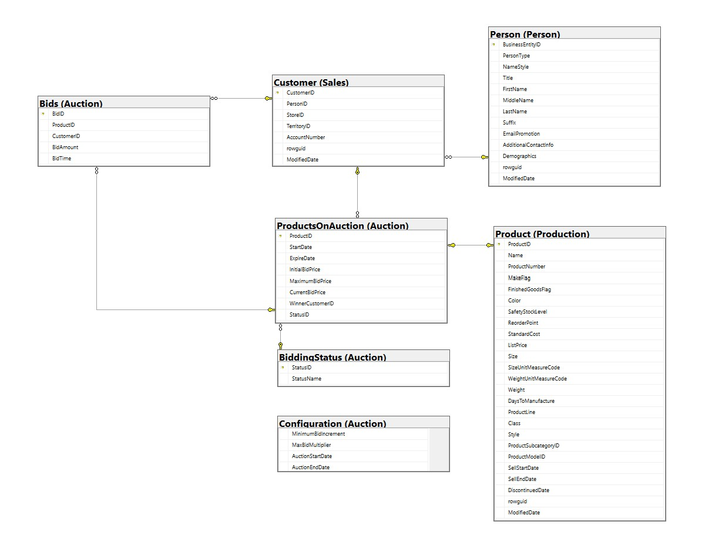

# 01 Auction System

## Business Problem
Adventure Works faces a recurring stock clearance issue where significant inventory of old bicycle models remains unsold when new models are announced in December. A previous 
discount campaign proved insufficient, so this year the company is implementing an online auction system to clear old stock during the last two weeks of November, including Black Friday.

## Solution
A T-SQL database extension to the AdventureWorks schema that implements a fully transactional auction system, including schema design, configuration management, and stored procedures to manage the end-to-end auction lifecycle.

## Schema Design

### Tables
| Table | Description |
|-------|-------------|
| `Auction.Configuration` | Global auction settings such as minimum bid increment and maximum bid multiplier |
| `Auction.BiddingStatus` | Lookup table for auction status values (Active, Closed, Cancelled) |
| `Auction.ProductsOnAuction` | Products currently or previously listed for auction |
| `Auction.Bids` | Individual bids placed by customers |

### Entity Relationship Diagram for Auction Schema

## Business Rules
- Only currently commercialised products are eligible for auction
- Products not manufactured in-house start at 75% of list price
- All other products start at 50% of list price
- Minimum bid increment is $0.05, maximum bid is the original list price
- Auction runs from November 16 to November 30

## Stored Procedures

| Procedure | Description |
|-----------|-------------|
| `uspAddProductToAuction` | Lists a product for auction with optional expiry date and initial bid price |
| `uspTryBidProduct` | Places a bid on behalf of a customer |
| `uspRemoveProductFromAuction` | Removes a product from auction, preserving bid history |
| `uspListBidsOffersHistory` | Returns a customer's bid history for a given time period |
| `uspUpdateProductAuctionStatus` | Updates auction statuses for all products, run before order dispatch |

## Technical Notes
- All objects created within the `Auction` schema
- Script is idempotent --> safe to run multiple times without duplicating data
- All stored procedures include full transaction management and error handling
- `CurrentBidPrice` is maintained on `ProductsOnAuction` for fast reads under high load (Black Friday)

## Design Decisions

### CurrentBidPrice on ProductsOnAuction
Rather than calculating the highest bid by querying the Bids table every time, 
we maintain a `CurrentBidPrice` column directly on `ProductsOnAuction`. This avoids 
expensive aggregation queries under high load, which is critical given the expected 
Black Friday traffic spike.

### WinnerCustomerID on ProductsOnAuction
When an auction closes, the winning customer is recorded directly on the 
`ProductsOnAuction` table. This makes order dispatch straightforward without 
needing to join back to the Bids table.

### BiddingStatus as a Lookup Table
Auction statuses (Active, Closed, Cancelled) are stored in a dedicated lookup 
table rather than hardcoded values. This makes the schema self-documenting and 
ensures referential integrity.

### Configuration as a Global Settings Table
All configurable thresholds such as minimum bid increment and maximum bid multiplier 
are stored in a single `Configuration` table. This means auction parameters can be 
adjusted without any schema or code changes.

### Idempotent Script
The script is safe to run multiple times. Tables are dropped and recreated in the 
correct dependency order, and configuration data is only inserted once using 
`IF NOT EXISTS` checks.

### THROW over RAISERROR
All stored procedures use `THROW` in the `CATCH` block rather than custom error 
codes. This preserves the original error context and stack trace, making debugging 
easier.

## How to Run
1. Download and restore the AdventureWorks 2014 database
2. Connect to your SQL Server instance in SSMS
3. Select your AdventureWorks database
4. Open and execute `auction.sql`
