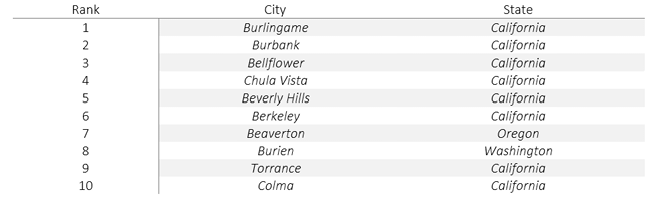
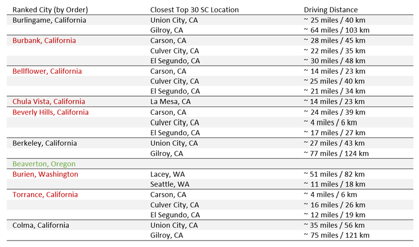

# 02 Market Expansion Analysis

## Business Problem
Adventure Works is planning to open its first two brick and mortar stores in the 
United States to sell directly to individual customers. To avoid competing with 
their existing retail partners, cities where their top 30 store customers (SC) 
are located must be excluded from consideration.

## Solution
A T-SQL analytical script that identifies the two optimal US cities for store 
expansion using a data-driven scoring approach. The analysis combines customer 
density, spending trends, and growth metrics to rank candidate cities.

## Methodology

### Phase 1 — Identify and Rank Top 30 SC Customers
Store contacts (SC) are ranked using a weighted scoring model based on four 
metrics. Raw metrics are first aggregated per customer, then normalised using 
Z-scores before applying weights to ensure no single metric dominates due to 
differences in scale.

| Metric | Weight |
|--------|--------|
| Total Sales Value | 50% |
| Order Frequency | 25% |
| Time Between First and Last Order | 15% |
| Average Time Between Orders | 10% |

The cities of the top 30 ranked SC customers are extracted and used as an 
exclusion list in Phase 2.

### Phase 2 — Identify Candidate Cities
All US cities are evaluated for individual customer (IN) density. Cities are 
included as candidates only if they meet both of the following conditions:
- At least 100 IN customers
- Not present in the top 30 SC customer city exclusion list

### Phase 3 — Score and Rank Candidate Cities
Remaining candidate cities are scored using a weighted model. Metrics are 
normalised using Z-scores before weighting. SC Density carries a negative 
weight to penalise cities with high reseller presence.

| Metric | Weight |
|--------|--------|
| IN Customer Density | 45% |
| Change in IN Spending | 35% |
| Change in IN Customers | 20% |
| SC Density | -30% |

Change metrics are calculated by comparing two consecutive six-month periods 
based on the most recent order date in the database (2014-06-30):
- **Recent period:** 2013-12-30 to 2014-06-30
- **Previous period:** 2013-06-30 to 2013-12-29

### Phase 4 — Final Selection
The top 10 ranked cities were assessed for geographic overlap using driving 
distances between candidate cities and top 30 SC locations via TravelMath 
(https://www.travelmath.com/distance/). Cities within 100 miles of each other 
were flagged to avoid market cannibalism between the two new stores.

## Design Decisions

### Temp Tables over Views
Intermediate results are stored in temp tables rather than views. This avoids 
re-executing expensive calculations every time a downstream query runs, and 
gives explicit control over when each step is computed.

### Z-Score Normalisation
All metrics are normalised using Z-scores before weighting. This ensures no 
single metric dominates the ranking due to differences in scale or units.

### Two Period Comparison
Customer growth is measured by comparing the most recent 6 months against the 
previous 6 months, giving a dynamic view of city momentum rather than just 
static totals. Time periods are calculated dynamically based on the most recent 
order date in the database rather than hardcoded dates.

### IN Customer Density Threshold
Cities with fewer than 100 individual (IN) customers were excluded from 
consideration. Analysis of the data distribution showed that 75% of US cities 
have fewer than 2 IN customers, with an average of 27 and a maximum of 259. 
Out of 351 US cities, only 66 exceed the 100 threshold. Crucially, lowering 
it to 50 only adds 4 more cities, while raising it to 150 drops to just 13 — 
confirming that 100 sits at a natural breakpoint in the distribution that 
balances inclusivity with commercial viability.

### Negative Weight on SC Density
Beyond the hard exclusion of top 30 SC cities, SC density carries a negative 
weight of -30% in the final scoring. This further penalises cities with high 
reseller presence, protecting existing retail partnerships even among cities 
that passed the exclusion filter.

### Geographic Separation of SC and IN Customer Bases
Analysis revealed that the top 30 SC customers are concentrated in states 
like Texas, Tennessee, and Utah, while the strongest IN customer cities are 
almost exclusively on the West Coast (California, Washington, and Oregon). 
This geographic separation means the SC exclusion rule had minimal impact on 
the candidate city pool, suggesting that Adventure Works' reseller and 
individual customer bases operate in largely distinct markets.

## Results

### Top 10 Candidate Cities

### Distance Comparison with Top 30 SC Cities
Cities highlighted in red were eliminated due to proximity to top 30 SC locations.
Beaverton (green) and Burlingame (no highlight) were selected as the final recommendations.

### Final Recommendations
| Store | City | State | Justification |
|-------|------|-------|---------------|
| 1 | Beaverton | Oregon | Strong IN density (246), growing customer base (+20) and spending (+$22,754). Geographically distinct from California candidates, avoiding overlap between the two stores. |
| 2 | Burlingame | California | Highest spending growth ($31,068) and strong customer growth (+31). Selected over other California cities due to superior growth metrics and geographic separation from top SC locations. |

## How to Run
1. Download and restore the AdventureWorks 2014 database
2. Connect to your SQL Server instance in SSMS
3. Select your AdventureWorks database
4. Open and execute `store_expansion.sql`
